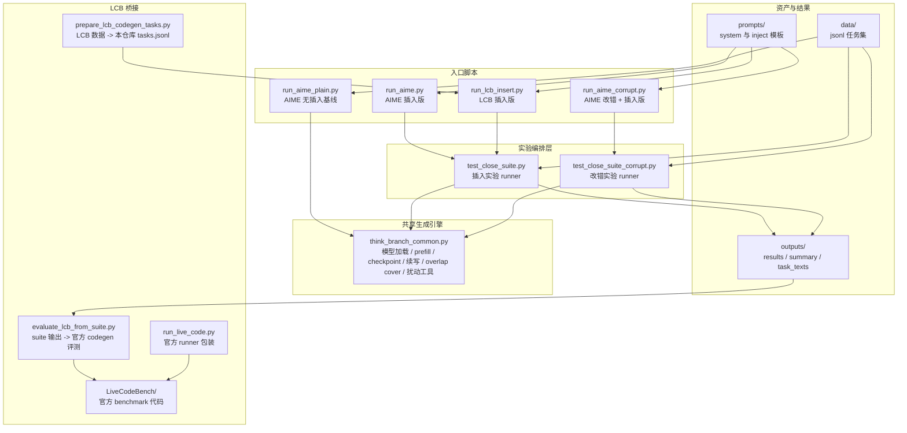
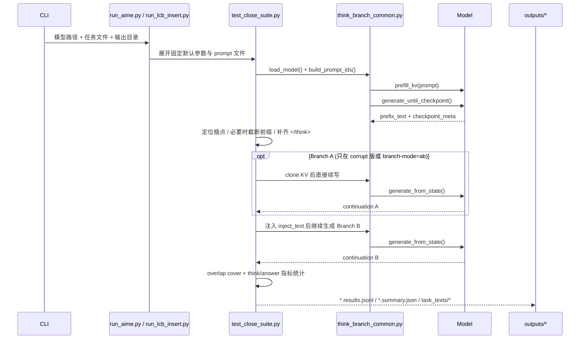
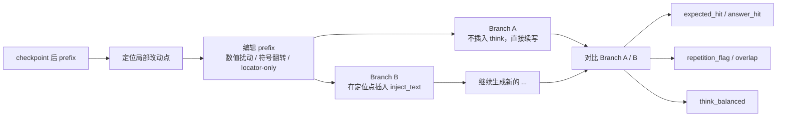
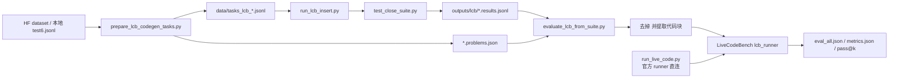

# close_think_experiement

这个仓库当前只关注一条核心实验线：

- 在模型已经开始生成之后，
- 在中途选一个位置插入新的 `<think>`，
- 观察模型是否会重新进入原生 `<think> ... </think>` 思考分布，
- 并在 `</think>` 之后从目标位置继续往下写。

当前只保留两个 benchmark：

- AIME
- LiveCodeBench

详细命令见 [RUN_COMMANDS.md](/Users/shuimo/Desktop/interleaved/close/RUN_COMMANDS.md)。

默认输出现在统一放在 `outputs/` 下，并且单模型文件名只使用模型目录 basename。
例如：

- `/scratch-ssd/guoeng/huggingface/models/Qwen3-32B`
- 会写成 `Qwen3-32B.results.jsonl`
- 不再写成整条 `_scratch-ssd_...` 路径

## 代码架构速览

如果只看当前还在维护的主线，这个仓库的代码可以分成三层：

1. 入口层：`run_aime_plain.py`、`run_aime.py`、`run_aime_corrupt.py`、`run_lcb_insert.py`
2. 编排层：`test_close_suite.py`、`test_close_suite_corrupt.py`
3. 引擎层：`think_branch_common.py`

再往外一圈是资产和桥接脚本：

- `data/`、`prompts/` 提供任务和注入模板
- `prepare_lcb_codegen_tasks.py`、`evaluate_lcb_from_suite.py`、`run_live_code.py` 负责 LCB 数据和官方评测对接
- `outputs/`、`suite_*`、`tmp/`、`spoctmp/` 主要是实验产物，不是主逻辑
- `LiveCodeBench/` 是内嵌的官方 benchmark 仓库，主要在 LCB 评测阶段参与

### 图 1：仓库主模块分层



### 图 2：一次插入实验的执行时序



`run_aime_plain.py` 是唯一的例外：它不经过 suite runner，而是直接调用 `think_branch_common.py` 做“无插入”基线生成。

### 图 3：改错实验的 A/B 对照关系



插入版 `run_aime.py` 和 `run_lcb_insert.py` 可以看成这张图的简化版：只保留 Branch B，不再生成 Branch A。

### 图 4：LiveCodeBench 数据与评测闭环



### 核心文件职责表

| 文件/目录 | 角色 | 读它能搞清什么 |
| --- | --- | --- |
| `think_branch_common.py` | 共享引擎 | 模型怎么加载、怎么 prefill、怎么在 checkpoint 停、怎么从插入点继续生成 |
| `test_close_suite.py` | 插入版总控 | 无改错情况下，Branch B 怎么构造、怎么评估、怎么落盘 |
| `test_close_suite_corrupt.py` | 改错版总控 | prefix 怎么被扰动，Branch A/B 怎么对照，改错元数据怎么记录 |
| `run_aime.py` | AIME 插入入口 | 当前 AIME 主实验的默认参数是什么 |
| `run_aime_corrupt.py` | AIME 改错入口 | 当前 A/B 改错线的固定配置是什么 |
| `run_aime_plain.py` | AIME 基线 | 没有中插时模型原始能力怎么跑 |
| `prepare_lcb_codegen_tasks.py` | LCB 数据适配 | 官方数据集怎么转成仓库内部 `tasks.jsonl` |
| `evaluate_lcb_from_suite.py` | LCB 评测桥 | Branch 输出怎么接回官方 codegen 评测 |
| `run_live_code.py` | 官方评测包装 | 不走中插实验时，怎样直接跑上游 LCB runner |
| `data/` + `prompts/` | 资产层 | 任务输入和注入文本分别从哪里来 |
| `outputs/` | 结果层 | 每次实验最终会写出哪些结构化结果 |

### 建议的读代码顺序

1. 先读 `run_aime.py` 或 `run_lcb_insert.py`，看这条实验线实际暴露了哪些参数。
2. 再读 `test_close_suite.py` 或 `test_close_suite_corrupt.py` 的 `run_task_ab()`，这是整条实验的主干。
3. 然后读 `think_branch_common.py` 里的 `generate_until_checkpoint()`、`generate_from_state()`、`apply_match_cover()`。
4. 最后按需读 `prepare_lcb_codegen_tasks.py` 和 `evaluate_lcb_from_suite.py`，理解 LCB 是怎么进出这个系统的。

## 背景

这条实验线要回答的问题是：

1. 如果模型在一次生成过程中已经写到一半，能不能通过中途插入一个新的 `<think>`，把它重新拉回原生的思考轨迹？
2. 这种插入，能不能让模型在局部不确定点重新检查最近的推理步骤，而不是直接复读前文或重新从头开始？
3. 如果前缀里故意放入一个局部错误，插入后的原生 think 能不能帮助模型修正后续续写？

所以这里的重点不是 prompt engineering 本身，而是：

- 中途介入生成轨迹；
- 在一个局部位置重新触发 think；
- 看这个 think 对后续 continuation 的影响。

## 方法

### 方法概述

四个核心入口是：

- [run_aime_plain.py](/Users/shuimo/Desktop/interleaved/close/run_aime_plain.py)
- [run_aime.py](/Users/shuimo/Desktop/interleaved/close/run_aime.py)
- [run_aime_corrupt.py](/Users/shuimo/Desktop/interleaved/close/run_aime_corrupt.py)
- [run_lcb_insert.py](/Users/shuimo/Desktop/interleaved/close/run_lcb_insert.py)

它们背后分别调用：

- [test_close_suite.py](/Users/shuimo/Desktop/interleaved/close/test_close_suite.py)
- [test_close_suite_corrupt.py](/Users/shuimo/Desktop/interleaved/close/test_close_suite_corrupt.py)

公共逻辑在：

- [think_branch_common.py](/Users/shuimo/Desktop/interleaved/close/think_branch_common.py)

### 插入是怎么做的

当前实现不是直接改 hidden state，也不是在已有 KV cache 中间硬插 token。

实际流程是：

1. 先正常构造 prompt，并保留模型原生 thinking。
2. 让模型先生成一段 prefix，直到某个 checkpoint 停下来。
3. 当前 AIME 默认会直接把 checkpoint 尾部当作插入点。
4. 也就是说，命中停机条件的那个位置，就是 Branch B 的实际插入点。
5. 把注入文本 `inject_text` 接到这个前缀后面。
6. 对新的前缀重新 tokenize / prefill，然后继续生成。

因此这套方法更准确地说是：

- 先生成到 checkpoint，再在这段 prefix 里精确定位插点；
- 真正执行插入时，用的是文本切片 + 重新 prefill；
- 当前 AIME 推荐配置下，输出效果上已经可以做到“停点 = 插点”。

当前 AIME 默认推荐的是 `think_end_punct`：

- 先等模型的第一个原生 `</think>`；
- 然后继续生成正文；
- 当正文走到大约 `300-400` token 窗口时，等下一个句号类 token；
- 命中后就在这个 token 处停下，并直接从这里插入新的 `<think>`。

因此当前 AIME 默认配置下，输出效果上已经可以做到“停点 = 插点”，而且不再依赖 step 锚点。

### 插入点怎么定位

当前 AIME 默认插入点主要来自 token 级 checkpoint：

1. `think_end_punct`  
   第一个原生 `</think>` 之后，走到 `checkpoint_mid_min_tokens` 到 `checkpoint_mid_max_tokens` 这段窗口，然后等待下一个句号类 token 作为停点和插点。

2. 旧 locator 逻辑  
   仓库里仍然保留 step / token fallback 的文本定位逻辑，主要是兼容旧实验和改错版。

也就是说：

- AIME 当前默认是 token 级停机，然后直接尾插；
- 旧 locator 路径仍然是字符位置切分 + 重新 prefill；
- 两条路径最终都会回到“插入 `<think>` 后重新生成后半段”。

### checkpoint 机制

prefix 会先生成到 checkpoint 再停。

当前常用模式有：

- `think_end`
- `regex`
- `think_end_then_regex`
- `think_end_mid`
- `think_end_punct`

实际最常用的是：

- AIME：先等第一个原生 `</think>`，再在正文 `300-400` token 附近等句号类 token 停下并插
- LCB：先等第一个原生 `</think>`，再向后走更长一段正文 token，再插

### 注入文本

system prompt 和 inject text 现在分工明确：

- system prompt 只负责约束“插入的 `<think>` 需要闭合，并且 `</think>` 之后继续正文”；
- inject text 负责告诉模型这段新 think 要做什么，例如反思、复核最近一步；
- inject text 默认还会在 `<think>` 前先放一小段过渡 token，用来让中途插入更平滑。

目的不是替模型写 reasoning，而是把模型重新推回原生的 think 分布，让它自己完成：

- `<think> ... </think>`
- 然后继续写最终答案或最终代码

相关 prompt 文件：

- [prompts/inject_think_v3.txt](/Users/shuimo/Desktop/interleaved/close/prompts/inject_think_v3.txt)
- [prompts/inject_think_codegen_aime_like_v2.txt](/Users/shuimo/Desktop/interleaved/close/prompts/inject_think_codegen_aime_like_v2.txt)

## 核心脚本

### `run_aime_plain.py`

用途：

- AIME 原始能力基线
- 不做插入
- 不做改错

它回答的问题是：

- 模型在没有任何中插干预时，原始 AIME 能力有多强？

### `run_aime.py`

用途：

- AIME 插入版
- 只做 Branch B
- 不做改错

它回答的问题是：

- 单纯中途插入 `<think>`，是否能稳定拉起新的原生 think，并继续解题？

当前 `run_aime.py` 顶层 CLI 已经收敛到这条主实验线，旧的 step / regex / locator 细粒度参数只保留在底层 `test_close_suite.py` 里做兼容。

### `run_aime_corrupt.py`

用途：

- AIME 改错版
- 支持 Branch A / Branch B 对照
- 在前缀里先做局部扰动，再看中插 `<think>` 的效果

它回答的问题是：

- 如果前缀推理局部出错，Branch B 的插入式 think 是否比直接续写更有机会纠正后续推理？

当前 `run_aime_corrupt.py` 顶层 CLI 也已经收敛到主改错线，旧的 regex / locator-only / step-anchor 细粒度参数不再从主入口暴露。

### `run_lcb_insert.py`

用途：

- LiveCodeBench 插入版
- 只做 Branch B
- 不做改错

它回答的问题是：

- 在代码生成已经进行到一半时，能否重新插入 think，并让模型继续输出更稳定的最终代码？

## 数据集

### AIME

当前主要用到这些任务文件：

- [data/tasks_aime2025.jsonl](/Users/shuimo/Desktop/interleaved/close/data/tasks_aime2025.jsonl)
  - AIME2025 全量题目
- [data/tasks_math_mix5_corrupt.jsonl](/Users/shuimo/Desktop/interleaved/close/data/tasks_math_mix5_corrupt.jsonl)
  - 小规模改错对比集
  - 每题自带 `corrupt_plan`、`corrupt_anchor_regex`、`corrupt_note`
- [data/tasks_math_hard_steps.jsonl](/Users/shuimo/Desktop/interleaved/close/data/tasks_math_hard_steps.jsonl)
  - 更难的 step-structured 数学题
- [data/tasks_aime2_hard2.jsonl](/Users/shuimo/Desktop/interleaved/close/data/tasks_aime2_hard2.jsonl)
  - AIME + hard 数学混合集

AIME 题目一般有：

- `user_prompt`
- `expected_regex`

有些改错任务还会额外指定：

- `corrupt_plan`
- `corrupt_note`

### LiveCodeBench

LCB 这条线使用：

- `livecodebench/code_generation_lite`
- 默认 release：`release_v6`

题目不是直接手写，而是通过：

- [prepare_lcb_codegen_tasks.py](/Users/shuimo/Desktop/interleaved/close/prepare_lcb_codegen_tasks.py)

导出为本仓库自己的 `tasks.jsonl` 格式，例如：

- [data/tasks_lcb_1q.jsonl](/Users/shuimo/Desktop/interleaved/close/data/tasks_lcb_1q.jsonl)

## 怎么验证

### 1. 插入版验证

对 insertion-only 任务，核心看三件事：

1. 能不能重新形成完整的 `<think> ... </think>`
2. `</think>` 之后会不会复读刚刚的 prefix
3. 最终答案 / 最终代码是否仍然有效

对应的主要指标是：

- `think_balanced_rate`
- `repetition_rate`
- `avg_overlap_prefix_to_continuation`
- `expected_hit_rate`

当前 AIME insertion 线的逐题导出和汇总已经做过精简。最常看的字段是：

- `answer`
- `answer_hit`
- `answer_hit_where`
- `matched_text`
- `think_closed`
- `trimmed`

这些汇总会写到：

- `*.summary.json`
- `summary_all_models.json`

### 2. AIME 改错对比

改错对比是当前最重要的验证方式。

对同一个被扰动过的 prefix，会生成两个分支：

- Branch A：直接续写
- Branch B：在定位点插入新的 `<think>`，再续写

你真正关心的是：

1. 在同一份错误前缀上，Branch B 是否比 Branch A 更容易恢复正确答案
2. Branch B 是否比 Branch A 更少复读
3. Branch B 的 think 是否更容易完整闭合

在 AIME 这条线上，最直接的判据就是：

- `expected_hit`
- `expected_hit_rate`

如果 Branch B 的 `expected_hit_rate` 高于 Branch A，而且复读不更严重，那么就说明插入式 think 在“改错/补救”这个任务上有价值。

### 3. LiveCodeBench 验证

LCB 不走 `expected_regex` 这条线，而是把 Branch B 最终输出接回官方 code generation 评测。

流程是：

1. 跑 [run_lcb_insert.py](/Users/shuimo/Desktop/interleaved/close/run_lcb_insert.py)
2. 用 [evaluate_lcb_from_suite.py](/Users/shuimo/Desktop/interleaved/close/evaluate_lcb_from_suite.py) 读取 Branch B
3. 去掉 `<think> ... </think>`
4. 提取最终代码块
5. 计算 LCB codegen metrics，例如 `pass@1`

所以 LCB 这条线验证的是：

- 插入式 think 是否有助于最终可执行代码质量

## 输出文件

每次运行的主输出通常包括：

- `*.results.jsonl`
- `*.summary.json`
- `summary_all_models.json`

如果开了 `--save-task-texts`，还会有逐题导出：

- `branch_A.full.txt`
- `branch_B.full.txt`
- `meta.json`

当前 AIME insertion 线里，`meta.json` 只保留：

- `answer`
- `answer_hit`
- `answer_hit_where`
- `matched_text`
- `think_closed`
- `trimmed`

当前 `*.summary.json` / `summary_all_models.json` 主要保留：

- `answer_hit_count`
- `answer_hit_rate`
- `answer_hit_where_counts`
- `think_closed_count`
- `think_closed_rate`
- `trimmed_count`
- `trimmed_rate`
- `avg_trimmed_chars`

对于改错版，还会额外生成：

- `*.branch_b_view.jsonl`
- `*.branch_b_view.md`

这些文件适合快速人工检查：

- 改错发生在哪里
- 插入发生在哪里
- Branch B 最终全文长什么样

## 最小运行入口

常用入口只有这四个：

```bash
python run_aime_plain.py ...
python run_aime.py ...
python run_aime_corrupt.py ...
python run_lcb_insert.py ...
```

更完整的命令见：

- [RUN_COMMANDS.md](/Users/shuimo/Desktop/interleaved/close/RUN_COMMANDS.md)

## 当前维护范围

如果只保留这条核心实验线，真正需要维护的文件是：

- [run_aime_plain.py](/Users/shuimo/Desktop/interleaved/close/run_aime_plain.py)
- [run_aime.py](/Users/shuimo/Desktop/interleaved/close/run_aime.py)
- [run_aime_corrupt.py](/Users/shuimo/Desktop/interleaved/close/run_aime_corrupt.py)
- [run_lcb_insert.py](/Users/shuimo/Desktop/interleaved/close/run_lcb_insert.py)
- [test_close_suite.py](/Users/shuimo/Desktop/interleaved/close/test_close_suite.py)
- [test_close_suite_corrupt.py](/Users/shuimo/Desktop/interleaved/close/test_close_suite_corrupt.py)
- [think_branch_common.py](/Users/shuimo/Desktop/interleaved/close/think_branch_common.py)
- [prepare_lcb_codegen_tasks.py](/Users/shuimo/Desktop/interleaved/close/prepare_lcb_codegen_tasks.py)
- [evaluate_lcb_from_suite.py](/Users/shuimo/Desktop/interleaved/close/evaluate_lcb_from_suite.py)

其它脚本可以视为历史遗留，或者至少不属于这条主线。
